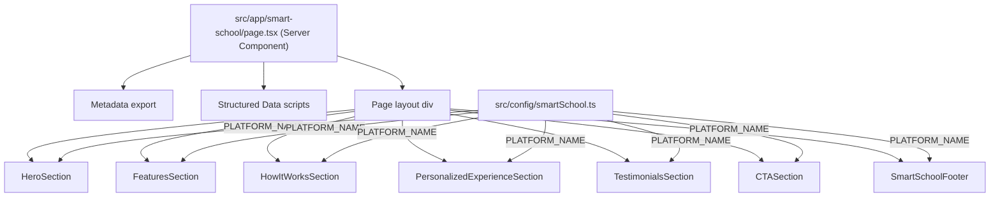

# Design Document: Smart School Landing Page

## Overview

This document describes the technical design for replacing the existing smart-school ERP landing page with a premium, student-focused AI learning platform landing page. The new page targets students and parents rather than school administrators, communicates the platform's AI-powered learning capabilities, and delivers a futuristic SaaS aesthetic using dark glassmorphism design.

The page lives at `/smart-school` and is composed of seven sections: Hero, Features, How It Works, Personalized Experience, Testimonials, CTA, and Footer. All section components are new files under `src/components/sections/smart-school/`. The existing ERP components in that directory are replaced entirely.

**Tech stack:** Next.js 15, React 19, Tailwind CSS v4, Framer Motion v12.

---

## Architecture

The page follows Next.js App Router conventions with a server component page entry point and client components for interactive/animated sections.



**Key architectural decisions:**

- `PLATFORM_NAME` is exported from a dedicated config file (`src/config/smartSchool.ts`) so it can be changed in one place and propagated everywhere.
- All section components are `'use client'` because they use Framer Motion animations.
- The page entry point (`page.tsx`) remains a server component to enable Next.js metadata and structured data injection.
- The existing global `Footer` component (`src/components/ui/Footer.tsx`) is not reused; a new `SmartSchoolFooter` section component is created to match the dark theme and display `PLATFORM_NAME`.

---

## Components and Interfaces

### Config

**`src/config/smartSchool.ts`**
```ts
export const PLATFORM_NAME = "Vertex AI"
```

### Section Components

All components live in `src/components/sections/smart-school/` and are `'use client'`.

| File | Replaces | Description |
|---|---|---|
| `HeroSection.tsx` | `HeroSection.tsx` | Animated hero with headline, subheading, two CTAs, particle/gradient background |
| `FeaturesSection.tsx` | `CoreFeaturesSection.tsx` | 4–6 glassmorphism feature cards with staggered entrance |
| `HowItWorksSection.tsx` | `AiLearningSection.tsx` | 3–4 numbered steps, horizontal timeline on desktop |
| `PersonalizedExperienceSection.tsx` | `DashboardPreviewSection.tsx` | Mock progress UI with animated indicators |
| `TestimonialsSection.tsx` | `WhyChooseUsSection.tsx` | Auto-scroll carousel with 3+ testimonial cards |
| `CTASection.tsx` | `ClosingCTASection.tsx` | Conversion-focused section with gradient background |
| `SmartSchoolFooter.tsx` | `DemoRequestForm.tsx` + `ParentsMobileSection.tsx` | Minimal dark footer with PLATFORM_NAME brand label |

### Shared Utilities

- **`src/components/ui/ScrollReveal.tsx`** — existing utility, available as fallback but Framer Motion `whileInView` is preferred for new components.
- **Framer Motion** — `motion.div`, `useInView`, `useMotionValue`, `useSpring`, `AnimatePresence` are the primary animation primitives.

### Component Props Interface Pattern

Each section component is self-contained with no required props (all data is co-located or imported from config):

```ts
// Example pattern — no external props needed
export default function FeaturesSection() { ... }
```

---

## Data Models

### Feature Card

```ts
interface FeatureCard {
  icon: React.ReactNode   // SVG icon element
  title: string           // ≤ 6 words
  description: string     // ≤ 30 words
}
```

Static data array defined inside `FeaturesSection.tsx`. Minimum 4 entries covering: textbook Q&A, personalized test generation, intelligent academic assistance, performance tracking.

### How It Works Step

```ts
interface Step {
  number: number          // 1–4
  title: string
  description: string
}
```

Static array of 3–4 steps defined inside `HowItWorksSection.tsx`.

### Testimonial

```ts
interface Testimonial {
  quote: string
  name: string
  role: string            // e.g. "Grade 11 Student"
}
```

Static array of ≥ 3 entries defined inside `TestimonialsSection.tsx`.

### Progress Subject

```ts
interface SubjectProgress {
  subject: string
  percentage: number      // 0–100
  color: string           // Tailwind color token or hex
}
```

Static array of ≥ 3 subjects defined inside `PersonalizedExperienceSection.tsx`.

---

## Correctness Properties

*A property is a characteristic or behavior that should hold true across all valid executions of a system — essentially, a formal statement about what the system should do. Properties serve as the bridge between human-readable specifications and machine-verifiable correctness guarantees.*

### Property 1: PLATFORM_NAME Propagation

*For any* string value assigned to `PLATFORM_NAME` in the config, every section that renders the brand name (Footer brand label, page metadata title) SHALL display that exact string — no other hard-coded brand name string shall appear in the rendered output.

**Validates: Requirements 1.2, 8.1**

### Property 2: Feature Card Content Constraints

*For any* feature card in the rendered `FeaturesSection`, the card's title SHALL contain no more than 6 words and the card's description SHALL contain no more than 30 words. The total number of cards SHALL be between 3 and 6 inclusive.

**Validates: Requirements 3.1**

### Property 3: Testimonial Card Completeness

*For any* testimonial card rendered in `TestimonialsSection`, the card SHALL contain a non-empty quote, a non-empty name, and a non-empty role string.

**Validates: Requirements 6.1**

### Property 4: All Seven Sections Rendered in Order

*For any* render of the `/smart-school` page, all seven sections (Hero, Features, How It Works, Personalized Experience, Testimonials, CTA, Footer) SHALL be present in the DOM in that exact order.

**Validates: Requirements 11.3**

### Property 5: Scroll-Triggered Animations on All Sections

*For any* major section component, entrance animations SHALL be triggered by viewport intersection (using Framer Motion `whileInView` or `useInView`) rather than on mount, so that off-screen sections do not animate prematurely.

**Validates: Requirements 9.2**

### Property 6: No Layout-Shift Animations

*For any* Framer Motion `animate`, `initial`, or `exit` prop used in the landing page, the animated CSS properties SHALL be limited to `opacity`, `x`, `y`, `scale`, and `rotate` — never `width`, `height`, `margin`, or `padding` — to prevent Cumulative Layout Shift.

**Validates: Requirements 9.4**

---

## Error Handling

### Missing Config Value
If `PLATFORM_NAME` is undefined or empty, components should fall back gracefully (empty string renders without crashing). No runtime error should be thrown.

### Animation Failures
Framer Motion animations are progressive enhancement — if the library fails to load or the browser reduces motion (`prefers-reduced-motion`), content must still be visible. All animated elements must have their final visible state as the non-animated fallback.

```ts
// Pattern: always set a visible default, animate from hidden
<motion.div
  initial={{ opacity: 0, y: 20 }}
  whileInView={{ opacity: 1, y: 0 }}
  // Content is visible if animation never fires
/>
```

### Carousel Edge Cases
The `TestimonialsSection` carousel must handle:
- Single testimonial: hide navigation controls, disable auto-scroll
- Index out of bounds: clamp to valid range `[0, testimonials.length - 1]`

### Responsive Layout
All sections must render without horizontal overflow at 320 px viewport width. Use `overflow-hidden` on section wrappers to prevent decorative blobs/gradients from causing scroll.

---

## Testing Strategy

This feature is primarily a UI rendering and animation feature. Property-based testing applies to a subset of requirements (data constraints, composition, animation configuration). The majority of tests are example-based unit tests and visual/snapshot tests.

### Unit Tests (Example-Based)

Focus on specific rendering correctness:

- `HeroSection` renders "Get Started" and "Try Now" buttons
- `HeroSection` headline does not contain `PLATFORM_NAME`
- `FeaturesSection` renders all four required capability topics
- `HowItWorksSection` renders 3–4 steps with connector elements
- `PersonalizedExperienceSection` renders progress indicator, ≥ 3 subjects, and streak metric
- `TestimonialsSection` renders navigation controls (dots or arrows)
- `CTASection` headline word count ≤ 10
- `CTASection` renders "Get Started" and "Learn More" buttons
- `SmartSchoolFooter` renders navigation links and copyright notice
- Page metadata title and description reference student learning, not ERP

### Property-Based Tests

Using a PBT library (e.g., **fast-check** for TypeScript):

**Property 1 — PLATFORM_NAME Propagation**
Generate arbitrary non-empty strings as `PLATFORM_NAME`, render the footer and page, assert the brand label matches the generated string and no other brand name literal appears.
- Tag: `Feature: smart-school-landing-page, Property 1: PLATFORM_NAME propagation`
- Minimum 100 iterations

**Property 2 — Feature Card Content Constraints**
For the static feature card data array, assert every card's title word count ≤ 6 and description word count ≤ 30, and array length is in [3, 6].
- Tag: `Feature: smart-school-landing-page, Property 2: feature card content constraints`
- Minimum 100 iterations (over generated word-count variations if data is parameterized)

**Property 3 — Testimonial Card Completeness**
For the static testimonial data array, assert every testimonial has non-empty quote, name, and role.
- Tag: `Feature: smart-school-landing-page, Property 3: testimonial card completeness`
- Minimum 100 iterations

**Property 4 — All Seven Sections Rendered in Order**
Render the page and assert the seven section root elements appear in the correct DOM order.
- Tag: `Feature: smart-school-landing-page, Property 4: all seven sections rendered in order`
- Minimum 100 iterations (over any render variations)

**Property 5 — Scroll-Triggered Animations**
For each section component, assert that `whileInView` or `useInView` is used for entrance animations (inspect component source or rendered motion props).
- Tag: `Feature: smart-school-landing-page, Property 5: scroll-triggered animations on all sections`

**Property 6 — No Layout-Shift Animations**
For all Framer Motion animation prop objects in the codebase, assert that no key from `{width, height, margin, padding, top, left, right, bottom}` appears.
- Tag: `Feature: smart-school-landing-page, Property 6: no layout-shift animations`

### Visual / Snapshot Tests

- Snapshot each section component at 320 px, 768 px, and 1280 px viewport widths
- Verify glassmorphism classes (`backdrop-blur`, `bg-white/10`, etc.) are present on card elements
- Verify dark background color classes are applied to section wrappers

### Integration / Smoke Tests

- `/smart-school` route returns HTTP 200
- Page renders without console errors
- `PLATFORM_NAME` constant is importable from `src/config/smartSchool.ts`
- No old ERP component imports exist in `page.tsx`
- All section components import from `src/components/sections/smart-school/`
